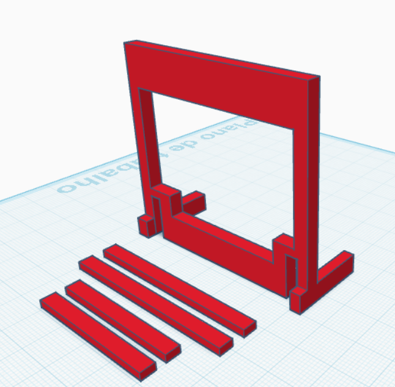
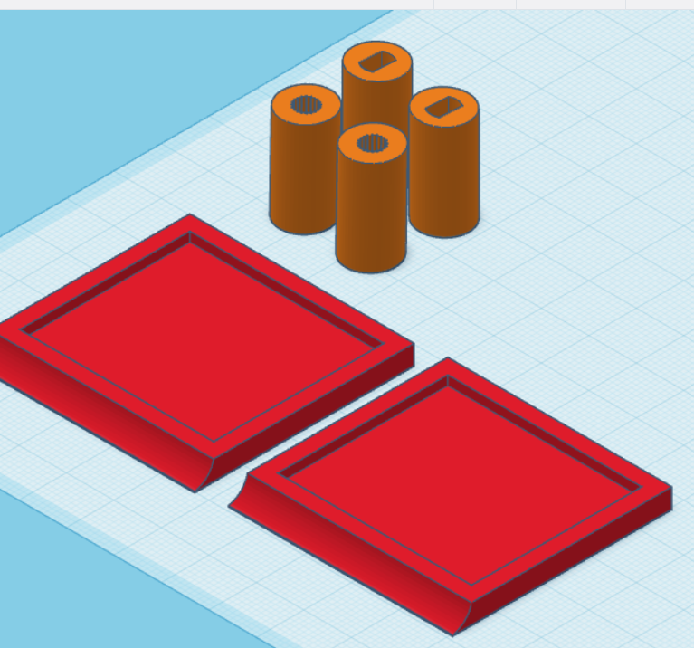

Projetos de Sistemas Embarcados - EmbarcaTech 2025
# 🏥 Sistema de Monitoramento de Ozônio v1.0

Autor: Jorge Wilker Mamede de Andrade, Mauricio Gonçales, Roger de Lima Araujo de Melo, Guilherme Alves dos Santos  
Curso: Residência Tecnológica em Sistemas Embarcados  
Instituição: EmbarcaTech - HBr  
Campinas, Agosto de 2025

# Sumário

- [Objetivo](#-objetivo)
- [Avanços](#-avanços)
- [Sensor](#-sensor)
- [Código](#-código)
- [Estrutura](#estrutura)
    - [Suporte](#suporte)
    - [Reservatório](#reservatório)
- [Atuadores](#-atuadores)

 

## 🎯 Objetivo

Este projeto implementa um sistema automatizado de monitoramento de concentração de ozônio para aplicações médicas em clínicas de ozonioterapia. O sistema utiliza sensor ZE14-O3 da Winsen para medição precisa em 6 níveis diferenciados (0.1 a 100 ppm), com alertas sonoros hospitalar-específicos e ventilação automática de emergência, garantindo segurança operacional em ambientes clínicos críticos.

 

## 🔝 Avanços

Estamos em fase de desenvolvimento de nosso protótipo final. Confira abaixo, os avanços por segmento no projeto:

 

### 🥶 Sensor
---
Fizemos vários testes e chegamos a um ponto satistfatório, o teste pode ser visualizado no vídeo abaixo:

 

### 💻 Código
---
O código está sendo desenvolvido e pode ser acessado no link abaixo:

 

### 🧱 Estrutura
---
A estrutura ainda está sendo desevolvida, já enviamos as peças auxiliares para a impressão 3D e compramos um reservatório ideal para o protótipo.

#### Suporte 

#### Reservatório

 

### 🧰 Atuadores
---
Por fim, mas não menos importante, começamos a testar os atuadores. Começando pelo servo motor, obtivemos um resultado satisfatório, conseguindo controlá-lo sem empecilhos. Confira no link abaixo:

